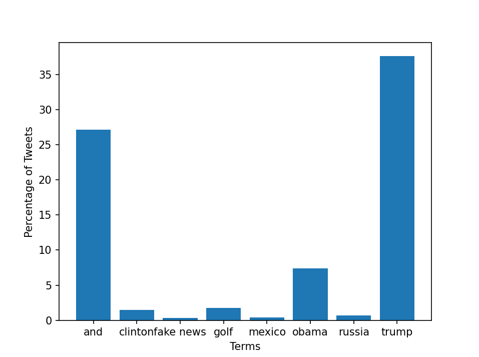

# Trump Tweets Analysis

This analysis shows the percentage of tweets containing specific keywords from Donald Trump's tweet history.

## Results:

| phrase            | percent of tweets |
| ----------------- | ----------------- |
|            obama  |             7.47 |
|            trump  |            38.35 |
|         fake news |             0.92 |
|            mexico |             0.55 |
|            russia |             1.13 |
|              wall |             0.91 |
| mainstream media  |             0.06 |
|              daca |             0.17 |

## Graph:

Below is the bar graph representing the percentage of tweets containing each keyword.

